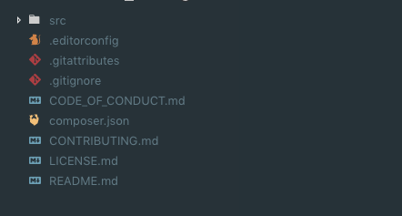

##  PHPackage - rapid package scaffolding.
[](https://packagist.org/packages/skoyah/phpackage)
[](https://packagist.org/packages/skoyah/phpackage)
[](https://packagist.org/packages/skoyah/phpackage)

How often do you find yourself doing the same things over and over when you want to create a new package?

This package allows you to run a simple console command to quiclkly scaffold a new folder structure for your PHP packages.
___
&nbsp;
## Installation

Start by installing this package on your global composer directory:
```shell
$ composer global require skoyah/phpackage
```

&nbsp;

## Usage
Now everytime you want to create a new package just run the following command on your terminal:
```shell
$ phpackage new awesome-package-name
```

This will create a folder sructure similar to this:



&nbsp;

In addition, if you want to use the well-known template
[Skeleton](https://github.com/thephpleague/skeleton), from [The PHP League](https://github.com/thephpleague), just run the same command with the `--src skeleton`flag. This will install the most recent version of that template.
```shell
$ phpackage new awesome-package-name --src="skeleton"
```

&nbsp;

## Adding PHPUnit
If you like to start writting your tests using PHPUnit, make sure to pass the optional flag `--unit` when creating a new package. This will add the `phpunit/phpunit` dev-dependency to your `composer.json` and also create the initial boilerplate to run your tests.

```shell
$ phpackage new awesome-package-name --unit
```

&nbsp;

## Easy, right?
 You're almost done! Just remember to edit the fields on your `composer.json` and then run `$ composer install` inside your project folder.

> ### Happy coding!
